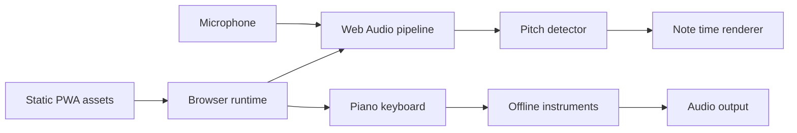

## adr_001_architecture_frontend_statique_local_first_de_canto - Architecture frontend statique local-first de Canto
> Date: 2026-08-07
> Status: Accepted
> Related request: `req_000_mvp_local_first_pour_apprendre_la_justesse_vocale_en_mode_libre`
> Related backlog: `item_001_mettre_en_place_le_socle_pwa_local_first`, `item_002_piano_visuel_et_sonore`, `item_003_capturer_la_voix_et_estimer_sa_hauteur_principale`, `item_004_visualisation_de_la_voix_sur_la_grille_de_notes_du_piano`, `item_005_validation_de_la_boucle_d_entrainement_libre`
> Related task: `task_001_orchestrer_la_livraison_du_mvp_mode_libre`
> Drivers: hors ligne sans backend, confidentialité du signal vocal, latence de retour visuel, matrice Chrome Android et Firefox, préparation du futur mode chansons
> Reminder: Update status, linked refs, decision rationale, consequences, and follow-up work when you edit this doc.

# Overview
Canto sera livré comme une PWA entièrement frontend dont l'audio, l'analyse de hauteur, le rendu et la persistance autorisée s'exécutent localement dans le navigateur.

# Context
- Le produit doit fonctionner sans compte, backend, transfert audio ou dépendance réseau pendant une séance.
- Le build doit être publiable directement depuis le dépôt à la racine HTTPS de `canto.paulmondou.fr`.
- La capture microphone, Web Audio et l'installation PWA imposent un contexte sécurisé, sauf localhost en développement.
- La matrice MVP comprend Chrome sur Android, Firefox desktop et Firefox Android ; les différences de politiques audio, permissions et PWA doivent être isolées derrière des adaptateurs testables.
- Le futur mode chansons aura besoin des mêmes primitives de temps musical, hauteur, rendu et transport, mais n'appartient pas au MVP.

# Decision
- Produire uniquement des ressources HTML, CSS, JavaScript, catalogues, manifestes et médias statiques ; aucune fonction serveur n'est requise à l'exécution.
- Configurer le build pour être servi à la racine du sous-domaine `canto.paulmondou.fr`.
- Utiliser les API Web Audio pour les instruments et l'analyse, avec traitement hors du thread d'interface lorsque la compatibilité et les mesures le justifient.
- Séparer quatre modules : primitives musicales, moteur d'instruments, pipeline microphone/détection et rendu de la trace.
- Exposer au rendu un flux normalisé contenant timestamp, fréquence fondamentale, note, octave, écart en cents, confiance et niveau ; seule la note et la trace sont obligatoirement visibles.
- Rendre la visualisation indépendante de l'algorithme de détection afin de pouvoir remplacer ou comparer ce dernier sans modifier l'interface.
- Utiliser un rendu 2D accéléré adapté à une trace continue ; Canvas 2D est le choix initial, sous réserve du prototype de performance.
- Mettre en cache l'ensemble des ressources nécessaires au mode libre via le service worker et éviter tout appel distant pendant la séance.
- Embarquer des ressources légères pour `Studio Grand` et `Soft Piano`, et synthétiser `Warm Organ` localement.
- Limiter la persistance navigateur aux préférences non sensibles validées ; le flux microphone et la trace de séance restent en mémoire volatile.
- Conserver le choix du framework d'interface libre jusqu'au bootstrap technique ; TypeScript et un outillage de build PWA moderne sont recommandés, mais le contrat statique prime sur le framework.

## Décisions arrêtées au bootstrap (2026-08-08)
- Outillage : Vite et TypeScript strict, sans framework d'interface. Le DOM est construit directement ; l'interface tient dans un écran unique et n'a pas besoin d'un moteur de rendu réactif.
- Rendu de la trace : Canvas 2D confirmé après mesure ; le budget d'analyse par fenêtre reste très inférieur au budget de retour de 150 ms.
- Détection : algorithme YIN implémenté comme fonction pure sur un buffer, exécuté depuis `AnalyserNode.getFloatTimeDomainData` sur le thread principal. Le déport hors thread reste possible sans changer le contrat du flux ; il n'est pas justifié par les mesures actuelles.
- Alignement : une seule source de géométrie horizontale (`src/music/layout.ts`) alimente le clavier DOM et le canvas, ce qui rend l'alignement structurellement vrai plutôt que reproduit deux fois.
- Instruments : les trois timbres sont synthétisés localement avec des nœuds Web Audio ; aucune banque d'échantillons n'est embarquée dans le MVP.
- Service worker : précache généré au build à partir du bundle réel, stratégie cache-first, aucune requête réseau pendant une séance.

# Consequences
- Le même artefact peut être servi par un hébergement statique et testé localement sans infrastructure applicative.
- Les modèles nécessitant un serveur, la synchronisation cloud et les analyses distantes sont exclus par construction du MVP.
- Les ressources des deux pianos doivent respecter un budget de poids hors ligne ; l'orgue synthétique n'ajoute pas de banque d'échantillons distante.
- La synthèse locale des trois timbres tient le budget hors ligne (bundle de 34 Ko de JavaScript, 11 Ko gzip) mais éloigne les deux pianos d'un rendu échantillonné ; remplacer la synthèse par des échantillons légers reste un travail de suite qui ne modifie pas ce contrat d'architecture.
- La qualité de détection dépend du navigateur, du microphone, du bruit ambiant et de la repisse ; un protocole par plateforme est nécessaire.
- Le calcul audio et le rendu doivent être profilés séparément pour tenir l'objectif de latence sans bloquer l'interface.
- Le déploiement devra fournir HTTPS, les bons types MIME, le fallback d'application et une stratégie de mise à jour du cache PWA.
- Une future intensité spectrale pourra consommer le même flux audio, mais elle restera un mode de rendu séparé de la trace fondamentale du MVP.

# References
- Related request: `req_000_mvp_local_first_pour_apprendre_la_justesse_vocale_en_mode_libre`
- Related backlog: `item_001_mettre_en_place_le_socle_pwa_local_first`, `item_002_piano_visuel_et_sonore`, `item_003_capturer_la_voix_et_estimer_sa_hauteur_principale`, `item_004_visualisation_de_la_voix_sur_la_grille_de_notes_du_piano`, `item_005_validation_de_la_boucle_d_entrainement_libre`
- Related task: `task_001_orchestrer_la_livraison_du_mvp_mode_libre`
