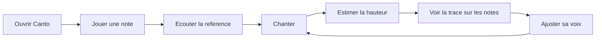

## prod_001_canto_mvp_mode_libre - Canto — MVP mode libre
> Date: 2026-08-07
> Status: Settled
> Related request: `req_000_mvp_local_first_pour_apprendre_la_justesse_vocale_en_mode_libre`
> Related backlog: `item_001_mettre_en_place_le_socle_pwa_local_first`
> Related task: `task_001_orchestrer_la_livraison_du_mvp_mode_libre`
> Related architecture: (none yet)
> Reminder: Update status, linked refs, scope, decisions, success signals, and open questions when you edit this doc.

# Overview
Une PWA locale qui aide à entendre une note puis à visualiser immédiatement la justesse de sa voix sur un repère musical partagé avec un piano.

# Product problem
- Une personne qui apprend à chanter entend difficilement si sa voix est exactement sur la note, trop haute ou trop basse.
- Les outils affichant seulement une fréquence en hertz ou une aiguille d'accordeur rendent mal la continuité d'une phrase vocale.
- La référence sonore et le retour visuel sont souvent séparés, ce qui complique le lien entre touche de piano, note entendue et note chantée.
- L'accès au microphone implique une attente forte de confidentialité et de contrôle explicite.

# Primary user
- Une personne débutante qui veut travailler sa justesse seule, par exercices courts, sur téléphone ou ordinateur.
- Le MVP suppose une voix monophonique, dans un environnement suffisamment calme, sans accompagnement musical simultané.

# Goals
- Rendre la relation entre sensation vocale, note entendue et hauteur chantée immédiatement visible.
- Offrir une boucle d'entraînement courte : jouer, écouter, chanter, ajuster.
- Garantir une expérience privée, sans compte et fonctionnelle hors ligne.
- Poser une architecture audio et visuelle réutilisable par un futur mode chansons.
- Proposer plusieurs couleurs de piano et un orgue, dont le son tenu peut servir de référence plus proche de la voix.

# MVP experience
1. L'utilisateur ouvre Canto et voit immédiatement la zone de trace et le piano partageant le même repère de notes.
2. Il joue une touche pour entendre une référence et identifier visuellement la note.
3. Il active volontairement le microphone après avoir lu que l'audio reste sur l'appareil.
4. Il chante ; Canto affiche la note dominante et une trace temporelle alignée horizontalement sur les touches du piano.
5. Il ajuste sa voix en observant si la trace rejoint puis stabilise la ligne de la note visée.
6. Il peut couper instantanément le microphone et le son du piano.

# Non-goals
- Mode chansons, karaoké, paroles ou accompagnement musical.
- Catalogue de morceaux, import de fichiers ou streaming.
- Notation de la performance, coaching automatique ou historique de progression.
- Reconnaissance des paroles, timbre, vibrato, volume ou qualité vocale avancée.
- Comptes, synchronisation cloud, backend ou collecte analytique.
- Enregistrement, export ou partage de la voix.
- Tutoriel, exercice guidé, indication textuelle trop haut/trop bas ou score de performance.

# Scope and guardrails
- In: un seul écran de pratique libre, piano interactif, plusieurs timbres de piano, un orgue, capture microphone, estimation monophonique de la fréquence fondamentale et trace temporelle alignée aux notes.
- In: plage d'analyse C2 à C6, deux octaves visibles, huit secondes d'historique, note détectée et zone juste de ±15 cents portée par la trace.
- In: installation PWA, fonctionnement hors ligne après premier chargement, interface anglaise responsive et accessibilité fondamentale.
- In: build frontend entièrement statique, publiable depuis le dépôt à l'adresse HTTPS `canto.paulmondou.fr`.
- Out: chansons, accompagnements, paroles, notes cibles défilantes, score, progression, comptes, cloud, import, export et enregistrement.
- Guardrail: l'audio du microphone est traité en mémoire dans le navigateur, sans enregistrement persistant ni transmission réseau.
- Guardrail: une estimation incertaine n'est jamais présentée comme une note fiable.
- Guardrail: l'utilisateur garde des commandes explicites et immédiatement accessibles pour arrêter l'entrée et la sortie audio.

# Key product decisions
- Le MVP est local-first et ne possède aucun backend.
- Canto est une PWA entièrement frontend ; le build ne produit que des fichiers statiques destinés à la racine de `canto.paulmondou.fr`.
- Le mode libre est l'unique mode livré ; le mode chansons influence seulement les frontières d'architecture réutilisables.
- La hauteur occupe l'axe horizontal, directement alignée sur les touches ; le présent naît près du piano et huit secondes d'historique remontent verticalement.
- La visualisation montre uniquement la fréquence fondamentale au MVP. Un mode futur pourra ajouter une intensité spectrale ou les harmoniques.
- La note la plus proche est affichée ; l'écart en cents est calculé pour la position et la couleur, sans valeur numérique obligatoire.
- La zone considérée juste est de ±15 cents.
- La plage analysée va de C2 à C6 ; deux octaves sont visibles simultanément avec commandes de changement d'octave.
- La référence d'accord est A4 = 440 Hz.
- Une note instrumentale est maintenue tant que la commande reste pressée et reçoit un léger fondu au relâchement.
- Les trois timbres du MVP sont `Studio Grand`, `Soft Piano` et `Warm Organ`.
- `Studio Grand` et `Soft Piano` utilisent des ressources légères embarquées ; `Warm Organ` est synthétisé localement. Tous fonctionnent hors ligne.
- L'usage avec le haut-parleur reste possible ; l'interface recommande un casque lorsque la repisse de l'instrument perturbe la détection vocale.
- L'orientation paysage est l'expérience mobile recommandée ; le portrait reste utilisable.
- La langue source et unique langue visible initiale est l'anglais.
- La matrice obligatoire comprend Chrome sur Android, Firefox desktop et Firefox Android.
- L'identité visuelle recherchée est technique, précise et proche d'un studio professionnel.
- Les seules données persistantes sont des préférences non sensibles ; aucune voix, séance, progression ou analytique n'est conservée.

# Success signals
- Un nouvel utilisateur réussit la boucle jouer, écouter, chanter, ajuster sans aide extérieure.
- Sur des signaux de test propres dans la plage vocale retenue, la note et l'écart en cents sont suffisamment exacts pour distinguer une voix juste d'une voix sensiblement trop haute ou trop basse.
- Le retour de hauteur est perçu comme immédiat et atteint l'objectif mesuré de 150 ms maximum hors latence matérielle non contrôlable.
- La trace reste lisible et fluide pendant une séance continue sur les appareils cibles.
- Huit secondes de trace restent visibles et la correspondance horizontale avec les touches est immédiate.
- Les deux pianos et l'orgue peuvent être sélectionnés hors ligne sans interrompre la séance.
- L'exercice complet fonctionne hors ligne après installation et aucune donnée microphone n'apparaît dans les requêtes réseau ou le stockage persistant.
- Les erreurs de permission et d'entrée audio permettent toujours de continuer à utiliser le piano.
- Le build statique peut être servi à la racine de `canto.paulmondou.fr` sans backend ni fonction serveur.
- Le produit et son manifeste utilisent le nom Canto.

# Open questions
- Aucune question produit bloquante restante pour cette version du corpus.

# References
- Product back-reference: `item_001_mettre_en_place_le_socle_pwa_local_first`
- Task back-reference: `task_001_orchestrer_la_livraison_du_mvp_mode_libre`
- Structured corpus source: `logics/scaffold/mvp-mode-libre.json`
