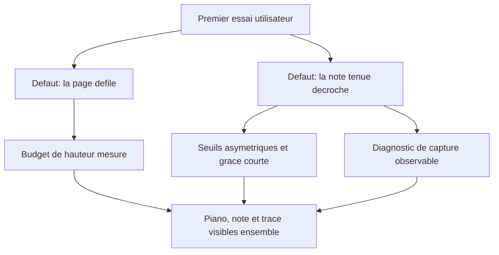

## prod_002_canto_mode_libre_lisibilite_et_fiabilite_apres_premier_essai - Canto mode libre : lisibilite et fiabilite apres premier essai
> Date: 2026-08-08
> Status: Proposed
> Related request: `req_001_corriger_les_deux_points_bloquants_remontes_au_premier_essai_du_mode_libre`
> Related backlog: `item_006_tenir_le_mode_libre_dans_un_seul_ecran`, `item_007_diagnostiquer_et_corriger_le_decrochage_de_la_detection_sur_note_tenue`
> Related task: `task_002_traiter_les_retours_du_premier_essai_du_mode_libre`
> Related architecture: (none yet)
> Reminder: Update status, linked refs, scope, decisions, success signals, and open questions when you edit this doc.
> Indicators reviewed: 2026-08-08

# Overview
Rendre la boucle jouer, chanter, ajuster reellement praticable : tout tient dans un ecran et la detection ne lache pas une note tenue.

# Goals
- Supprimer le defilement entre le piano et le retour visuel de hauteur.
- Tenir une note aussi longtemps que l'utilisateur la chante.
- Rendre le comportement du pipeline audio observable pour les prochains diagnostics.

# Non-goals
- Supprimer les notes fantomes pendant la recherche de hauteur, jugees representatives d'une voix non encore calee.
- Ajouter un mode chansons, une evaluation ou un historique de seance.
- Remplacer la synthese des timbres par des echantillons.

# Scope and guardrails
- In: scaffolded request, product, backlog, orchestration task, validation, and handoff context.
- Out: unrelated workflow docs and implementation of generated tasks.

# Key product decisions
- Use structured input as the source of truth for generated docs.
- Keep generated write paths local and repo-bounded.

# Success signals
- Generated docs pass lint and audit without broad manual rewrites.
- Context-pack output can be handed to an implementation agent directly.

# References
- Product back-reference: `req_001_corriger_les_deux_points_bloquants_remontes_au_premier_essai_du_mode_libre`
- Task back-reference: `task_002_traiter_les_retours_du_premier_essai_du_mode_libre`
